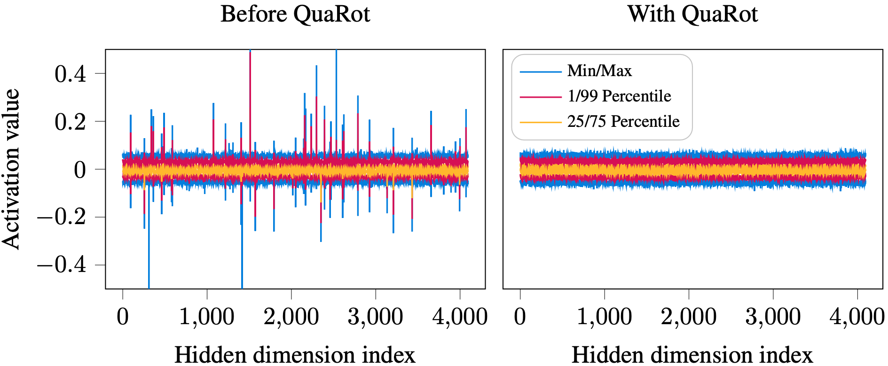

# QuaRot: Outlier-Free 4-Bit Inference in Rotated LLMs
This repository contains the code for [**QuaRot**: Outlier-Free 4-Bit Inference in Rotated LLMs](https://arxiv.org/abs/2404.00456).


## Abstract
We introduce QuaRot, a new **Qua**ntization scheme based on **Rot**ations, which is able to quantize LLMs end-to-end, including all weights, activations, and KV cache in 4 bits. QuaRot rotates LLMs in a way that removes outliers from the hidden state without changing the output, making quantization easier. This *computational invariance* is applied to the hidden state (residual) of the LLM, as well as to the activations of the feed-forward components, aspects of the attention mechanism and to the KV cache. The result is a quantized model where all matrix multiplications are performed in 4-bits, without any channels identified for retention in higher precision. Our quantized **LLaMa2-70B** model has losses of at most **0.29 WikiText perplexity** and retains **99% of the zero-shot** performance.



## Usage


Compile the QuaRot kernels using the following commands:

```bash
git clone https://github.com/spcl/QuaRot.git
cd QuaRot
pip install -e .  # or pip install .
```

For simulation results, check [fake_quant](https://github.com/spcl/QuaRot/tree/main/fake_quant) directory.


### Citation 

The full citation is

```
@article{ashkboos2024quarot,
  title={QuaRot: Outlier-Free 4-Bit Inference in Rotated LLMs},
  author={Ashkboos, Saleh and Mohtashami, Amirkeivan and Croci, Maximilian L and Li, Bo and Jaggi, Martin and Alistarh, Dan and Hoefler, Torsten and Hensman, James},
  journal={arXiv preprint arXiv:2404.00456},
  year={2024}
}
```
